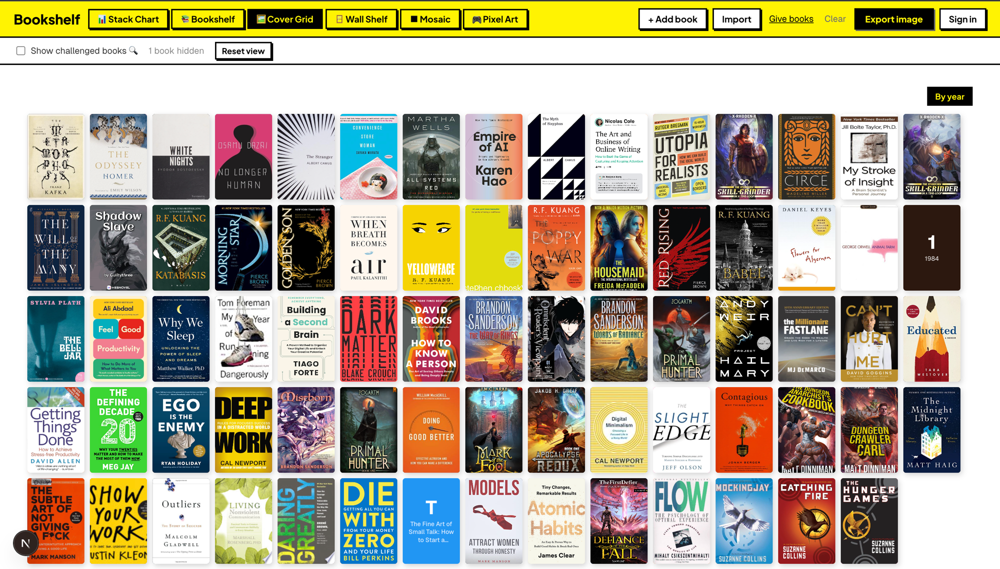
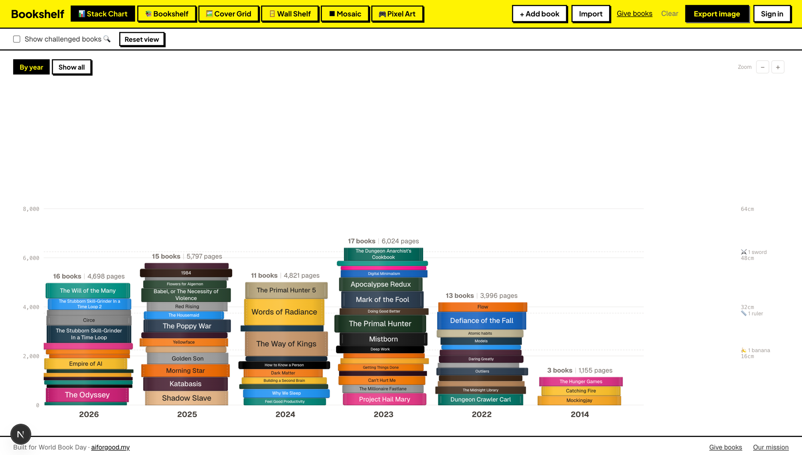
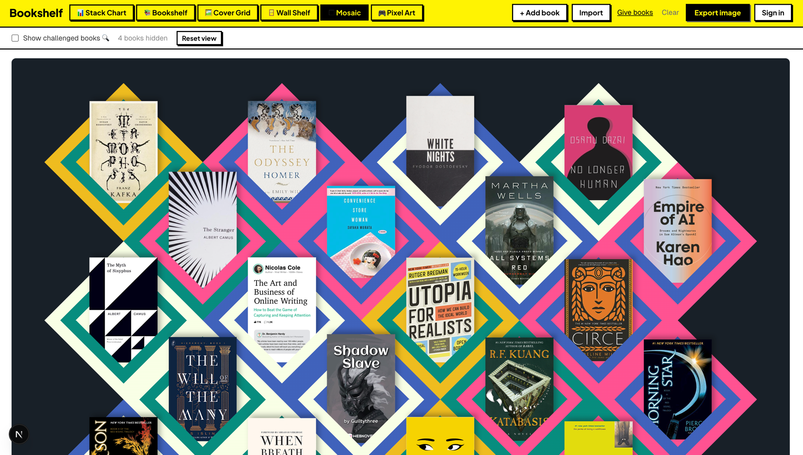

<p align="center">
  
</p>

<h1 align="center">Bookshelf</h1>
<p align="center"><em>Your reading life, beautifully visualized.</em></p>

<p align="center">
  <a href="LICENSE"></a>
  
  <a href="https://aiforgood.my"></a>
</p>

---

Bookshelf turns your reading library into a stunning, shareable poster. Import from [Hardcover](https://hardcover.app) or [Goodreads](https://goodreads.com), arrange your books into a grid, mosaic, or stack layout, then export as a print-quality image. It's a free, open-source Goodreads alternative for people who care how their reading life looks — a digital bookshelf you'll actually want to share. Every share is also a quiet reminder that 773 million adults can't read at all.

## Screenshots

| Grid | Stack | Mosaic |
|------|-------|--------|
|  |  |  |

## Features

- **Import** from Hardcover or Goodreads CSV — or add books manually
- **Drag-and-drop curation** — reorder and pick exactly what goes on your poster
- **3 visualization styles** — grid, stack, and mosaic layouts
- **Multiple export formats** — download as PNG for social, print, or wallpaper
- **Auth** via Clerk — sign in with email or social providers
- **Cloud sync** via Convex — your library is saved and synced across devices
- **Open source** — AGPL v3 licensed, self-hostable

## Tech stack

| Layer | Technology |
|-------|------------|
| Framework | Next.js 16, React 19 |
| Language | TypeScript (strict) |
| Styling | Tailwind CSS v4 + inline styles |
| Auth | Clerk |
| Database / sync | Convex |
| Book data | Hardcover API |
| Tests | Playwright |

## Getting started

### Prerequisites

- Node.js 20+
- npm

### Setup

```bash
# 1. Clone
git clone https://github.com/mfrashad/bookshelf.git
cd bookshelf

# 2. Install dependencies
npm install

# 3. Configure environment
cp .env.example .env.local
# Edit .env.local and fill in your keys (see Env vars below)

# 4. Start Convex (keep this running in its own terminal)
npx convex dev

# 5. Start the dev server
npm run dev
```

Open [http://localhost:3000](http://localhost:3000).

## Env vars

Copy `.env.example` to `.env.local` and fill in each value:

| Variable | Where to get it |
|----------|-----------------|
| `NEXT_PUBLIC_CLERK_PUBLISHABLE_KEY` | [Clerk dashboard](https://clerk.com/dashboard) → API Keys |
| `CLERK_SECRET_KEY` | [Clerk dashboard](https://clerk.com/dashboard) → API Keys |
| `NEXT_PUBLIC_CLERK_SIGN_IN_URL` | Leave as `/sign-in` for local dev |
| `NEXT_PUBLIC_CLERK_SIGN_UP_URL` | Leave as `/sign-up` for local dev |
| `NEXT_PUBLIC_CLERK_AFTER_SIGN_IN_URL` | Leave as `/library` for local dev |
| `NEXT_PUBLIC_CLERK_AFTER_SIGN_UP_URL` | Leave as `/onboarding` for local dev |
| `NEXT_PUBLIC_CONVEX_URL` | Auto-generated by `npx convex dev` — check `.env.local` after running it |
| `HARDCOVER_API_KEY` | [Hardcover account settings](https://hardcover.app/account/api) — optional |
| `NEXT_PUBLIC_BASE_URL` | `http://localhost:3000` locally; your production domain on deploy |

## Project structure

```
src/app/
├── page.tsx          # Landing page
├── library/          # Main book library + poster editor
├── import/           # Hardcover / Goodreads import flow
├── give/             # NGO donation page
├── impact/           # Literacy mission page
├── onboarding/       # New-user setup
├── sign-in/          # Clerk sign-in
├── sign-up/          # Clerk sign-up
└── api/              # Route handlers

convex/               # Convex schema, mutations, queries, actions
```

## Available scripts

| Command | What it does |
|---------|-------------|
| `npm run dev` | Start local dev server |
| `npm run build` | Production build |
| `npm run start` | Serve production build |
| `npm run lint` | ESLint check |
| `npm run test:e2e` | Run Playwright tests headlessly |
| `npm run test:e2e:ui` | Open Playwright interactive UI |

## Contributing

Contributions are warmly welcomed — see [CONTRIBUTING.md](CONTRIBUTING.md) for the full guide.

If this project has been useful to you, consider **[starring it on GitHub](https://github.com/mfrashad/bookshelf)** — it helps others find it.

## Mission

Bookshelf was built on World Book Day as a free gift to readers everywhere. Every library shared is a quiet reminder that reading is a privilege — and a right. [Read more about our literacy mission →](https://bookshelf.aiforgood.my/impact)

## Credits

Built by [Fathy Rashad](https://rashadcodes.com) for [aiforgood.my](https://aiforgood.my) — a Malaysian initiative using AI to create tools that matter.

## License

[AGPL v3](LICENSE) © 2026 Fathy Rashad
